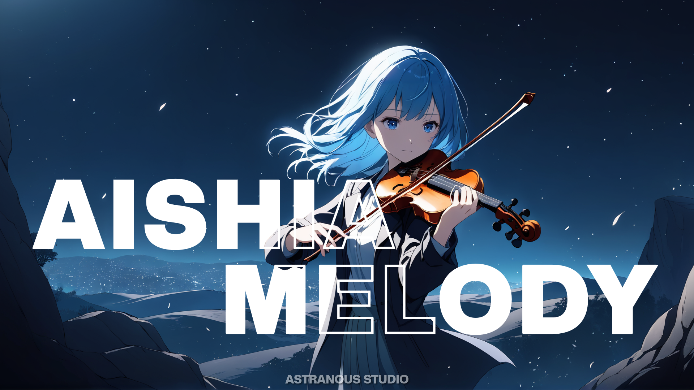

  <strong>Advance Discord bot using Discord.js version 14.20.0.</strong>
  

    <a href="https://github.com/Xzeel/Aishia-Melody"><b>Github</b></a> •
    <a href="https://discord.com/invite/UF8dSpCkFa"><b>Support</b></a>

  <a href="https://discord.js.org/">

 
  

